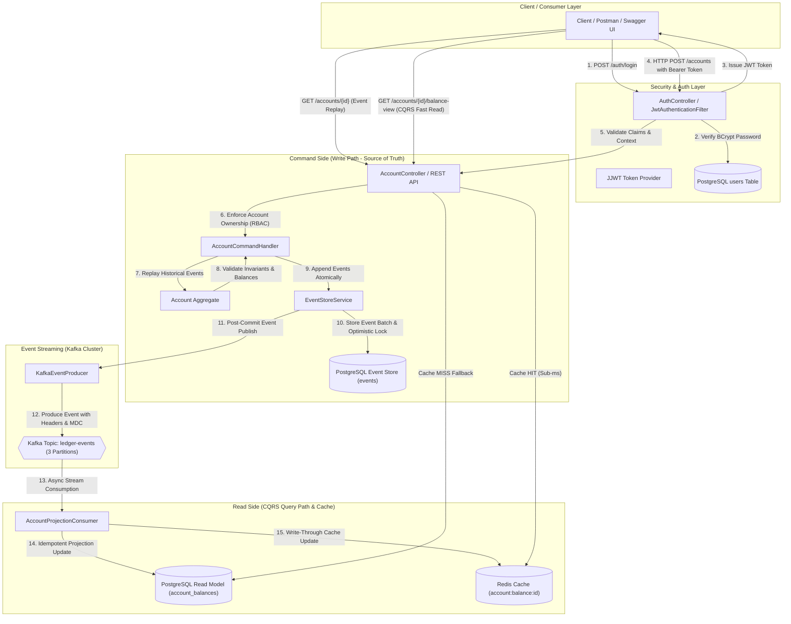

# Event-Sourced Digital Banking Ledger with CQRS Architecture


An enterprise-grade, high-throughput Digital Banking Ledger built with **Spring Boot 3**, **PostgreSQL**, **Apache Kafka**, and **Redis**. Implements **Event Sourcing**, **CQRS (Command Query Responsibility Segregation)**, **Double-Entry Accounting**, **Redis Cache-Aside/Write-Through caching**, and **JWT Security with Role-Based Access Control (RBAC)**.

---

## 🏛️ System Architecture



---

## 📂 Project Structure

```text
CQRS/
├── docker-compose.yml                      # Infrastructure: PostgreSQL 16, Kafka KRaft, Redis 7
├── pom.xml                                 # Maven dependencies (Spring Boot 3.3.0, Kafka, Redis, Security, JJWT, OpenAPI, Actuator)
└── src/
    ├── main/
    │   ├── java/com/bank/ledger/
    │   │   ├── api/
    │   │   │   ├── AccountController.java   # REST Controller (Commands + CQRS Queries + RBAC Ownership checks)
    │   │   │   ├── DTOs.java                # DTOs: LoginRequest, LoginResponse, AccountResponse, ErrorResponse
    │   │   │   └── GlobalExceptionHandler.java # Uniform REST exception mapper (400, 401, 403, 404, 409, 422, 500)
    │   │   ├── auth/
    │   │   │   ├── AuthController.java      # Login endpoint POST /auth/login
    │   │   │   ├── CustomAccessDeniedHandler.java # 403 Forbidden JSON Handler
    │   │   │   ├── CustomAuthenticationEntryPoint.java # 401 Unauthorized JSON Handler
    │   │   │   ├── JwtAuthenticationFilter.java # Stateless Bearer token filter
    │   │   │   ├── JwtTokenProvider.java    # HMAC-SHA256 JWT generator & validator
    │   │   │   ├── SecurityConfig.java      # Spring Security FilterChain & BCrypt encoder configuration
    │   │   │   ├── UserEntity.java          # JPA entity for 'users' table
    │   │   │   └── UserRepository.java      # Spring Data JPA repository for user lookup
    │   │   ├── command/
    │   │   │   ├── AccountAggregate.java    # Pure Aggregate rebuilding state via event replay
    │   │   │   ├── AccountCommandHandler.java # Handles Open, Deposit, Withdraw, Transfer commands
    │   │   │   └── Commands.java            # Command definitions
    │   │   ├── config/
    │   │   │   ├── CorrelationIdFilter.java # Servlet filter for X-Correlation-ID tracing
    │   │   │   ├── OpenApiConfig.java       # Swagger UI OpenAPI 3.0 bean with Bearer JWT Auth
    │   │   │   └── RedisConfig.java         # RedisTemplate Jackson JSON serializer setup
    │   │   ├── events/
    │   │   │   ├── AccountOpenedEvent.java  # Domain Event: AccountOpened
    │   │   │   ├── FundsDepositedEvent.java # Domain Event: FundsDeposited
    │   │   │   ├── FundsWithdrawnEvent.java # Domain Event: FundsWithdrawn
    │   │   │   ├── TransferInitiatedEvent.java # Domain Event: TransferInitiated
    │   │   │   ├── KafkaEventProducer.java  # Publishes committed events to Kafka with headers & MDC
    │   │   │   └── KafkaTopicConfig.java   # Auto-creates 'ledger-events' (3 partitions)
    │   │   ├── eventstore/
    │   │   │   ├── EventEntity.java         # JPA entity for append-only 'events' table
    │   │   │   └── EventStoreService.java   # Appends events, enforces versioning & optimistic locking
    │   │   └── readmodel/
    │   │       ├── AccountBalanceEntity.java # Read model entity for 'account_balances'
    │   │       ├── AccountCacheService.java # Redis Cache-Aside & Write-Through operations
    │   │       └── AccountProjectionConsumer.java # Idempotent Kafka Listener projecting events to PG & Redis
    │   └── resources/
    │       ├── application.yml              # Database, Kafka, Redis, Actuator, & Logging config
    │       └── db/migration/
    │           ├── V1__init_event_store.sql # Schema migration for Event Store (events table & index)
    │           ├── V2__init_read_model.sql  # Schema migration for CQRS Read Model (account_balances table)
    │           └── V3__init_users.sql       # Schema migration for Users & seeded BCrypt test accounts
    └── test/
        └── java/com/bank/ledger/
            ├── auth/AuthSecurityTest.java   # JUnit 5 tests for BCrypt matching & JWT claims
            └── command/AccountAggregateTest.java # JUnit 5 tests for Aggregate, Replay & Invariants
```

---

## 🔐 Seeded Test Credentials & Roles

| Username | Plaintext Password | Role | Permissions & Account Ownership Rules |
| :--- | :--- | :--- | :--- |
| **`admin`** | `admin123` | `ROLE_ADMIN` | Can view and operate on **any** account in the system. |
| **`alice`** | `alice123` | `ROLE_CUSTOMER` | Can open and operate strictly on accounts owned by `alice`. |
| **`bob`** | `bob123` | `ROLE_CUSTOMER` | Can open and operate strictly on accounts owned by `bob`. |

---

## 🚀 Key Architectural Principles

> [!IMPORTANT]
> **1. JWT Authentication & Role-Based Access Control (RBAC)**
> - `POST /auth/login` verifies credentials via BCrypt and returns an HMAC-SHA256 signed JWT (1-hour expiration).
> - All `/accounts/**` endpoints require `Authorization: Bearer <token>`.
> - A `CUSTOMER` can only operate on/view accounts where `ownerName` matches their authenticated username.
> - An `ADMIN` can view and operate on any account.

> [!IMPORTANT]
> **2. Event Sourcing & Immutable Ledger**
> - The write side has **no mutable `balance` table**. Account state is reconstructed on-demand by replaying ordered, immutable domain events (`AccountOpened`, `FundsDeposited`, `FundsWithdrawn`, `TransferInitiated`) from PostgreSQL.

> [!NOTE]
> **3. Double-Entry Accounting Invariant**
> - Every transfer atomically generates a **Debit** entry (withdrawal on source) and a **Credit** entry (deposit on destination).
> - Enforces `SUM(Debits) == SUM(Credits)` prior to event persistence. If the invariant fails, the transaction is rejected.

> [!TIP]
> **4. Optimistic Concurrency Control**
> - Uses an aggregate `version` column and `(aggregate_id, version)` unique constraint in PostgreSQL to detect concurrent modifications, throwing `OptimisticLockingException` (HTTP 409 Conflict).

> [!NOTE]
> **5. CQRS Read Model & Redis Caching**
> - **Command Path**: Appends events to PostgreSQL event store.
> - **Async Projection**: `AccountProjectionConsumer` streams Kafka events and updates PostgreSQL `account_balances`.
> - **Write-Through**: `AccountProjectionConsumer` writes updated balances directly to Redis.
> - **Cache-Aside Read Path**: `GET /accounts/{id}/balance-view` checks Redis first (sub-millisecond), falling back to PostgreSQL read model on a cache miss.

---

## 🛠️ Technology Stack

- **Core Framework**: Java 17+, Spring Boot 3.3.0
- **Security & Auth**: Spring Security, JJWT 0.12.5 (HMAC-SHA256), BCrypt
- **Database**: PostgreSQL 16 (Event Store, CQRS Read Model, Users)
- **Database Migrations**: Flyway
- **Event Streaming**: Apache Kafka 3.7.0 (KRaft mode)
- **Cache**: Redis 7
- **API Documentation**: Springdoc OpenAPI / Swagger UI (with Bearer Token **Authorize 🔓** button)
- **Observability**: Spring Boot Actuator & SLF4J MDC (`X-Correlation-ID`)
- **Testing**: JUnit 5

---

## ⚡ How to Run Locally

### Prerequisites
- Docker Desktop & Docker Compose
- Java 17+
- Maven 3.8+

### 1. Start Infrastructure Containers
```bash
docker compose up -d
```

### 2. Launch Spring Boot Application
```bash
mvn spring-boot:run
```
The server will start on `http://localhost:8080`.

---

## 🔍 Interactive Documentation & Health Checks

- **Swagger UI (Interactive API Tester with Bearer JWT Authorize Button)**:  
  [http://localhost:8080/swagger-ui.html](http://localhost:8080/swagger-ui.html)

- **Actuator Infrastructure Health Check**:  
  `GET http://localhost:8080/actuator/health`  
  *Returns health status for PostgreSQL, Redis, and disk space in a single payload.*

---

## 📡 API Reference & cURL Verification Examples

### 1. Authenticate & Obtain JWT Token
```bash
curl -X POST http://localhost:8080/auth/login \
  -H "Content-Type: application/json" \
  -d '{
    "username": "alice",
    "password": "alice123"
  }'
```
**Response (HTTP 200 OK):**
```json
{
  "token": "eyJhbGciOiJIUzI1NiJ9.eyJzdWIiOiJhbGljZSIsInJvbGUiOiJDVVNUT01FUiIsImlhdCI6MTc4ODU0NDAwMCwiZXhwIjoxNzg4NTQ3NjAwfQ...",
  "username": "alice",
  "role": "CUSTOMER"
}
```

---

### 2. Open an Account (Authenticated Customer)
```bash
curl -X POST http://localhost:8080/accounts \
  -H "Content-Type: application/json" \
  -H "Authorization: Bearer <ALICE_JWT_TOKEN>" \
  -d '{
    "ownerName": "Alice",
    "initialBalance": 1000.00
  }'
```
**Response (HTTP 201 Created):**
```json
{
  "accountId": "a1b2c3d4-5678-90ab-cdef-1234567890ab",
  "ownerName": "alice",
  "balance": 1000.00,
  "version": 1
}
```

---

### 3. Deposit Funds into Own Account
```bash
curl -X POST http://localhost:8080/accounts/a1b2c3d4-5678-90ab-cdef-1234567890ab/deposit \
  -H "Content-Type: application/json" \
  -H "Authorization: Bearer <ALICE_JWT_TOKEN>" \
  -d '{
    "amount": 250.00
  }'
```
**Response (HTTP 200 OK):**
```json
{
  "accountId": "a1b2c3d4-5678-90ab-cdef-1234567890ab",
  "ownerName": "alice",
  "balance": 1250.00,
  "version": 2
}
```

---

### 4. Demonstrate 403 Forbidden (Bob Accessing Alice's Account)
```bash
curl -X GET http://localhost:8080/accounts/a1b2c3d4-5678-90ab-cdef-1234567890ab \
  -H "Authorization: Bearer <BOB_JWT_TOKEN>"
```
**Response (HTTP 403 Forbidden):**
```json
{
  "status": 403,
  "error": "Forbidden",
  "message": "Access denied: You do not have permission to access accounts owned by 'alice'",
  "timestamp": 1788544000000
}
```

---

### 5. Demonstrate 401 Unauthorized (Missing/Invalid Token)
```bash
curl -X GET http://localhost:8080/accounts/a1b2c3d4-5678-90ab-cdef-1234567890ab
```
**Response (HTTP 401 Unauthorized):**
```json
{
  "status": 401,
  "error": "Unauthorized",
  "message": "Full authentication is required to access this resource. Missing or invalid Bearer token.",
  "timestamp": 1788544000000
}
```

---

### 6. Admin Access (Accessing Any Account)
```bash
curl -X GET http://localhost:8080/accounts/a1b2c3d4-5678-90ab-cdef-1234567890ab \
  -H "Authorization: Bearer <ADMIN_JWT_TOKEN>"
```
**Response (HTTP 200 OK):**
```json
{
  "accountId": "a1b2c3d4-5678-90ab-cdef-1234567890ab",
  "ownerName": "alice",
  "balance": 1250.00,
  "version": 2
}
```

---

## 🧪 Unit & Integration Testing

Run the automated test suite:
```bash
mvn clean test
```
**Tests Executed:**
- `AuthSecurityTest.testBCryptMatches`
- `AuthSecurityTest.testJwtTokenProvider`
- `AccountAggregateTest.replayCorrectlyRebuildsBalanceAndVersion`
- `AccountAggregateTest.insufficientBalanceRejectsWithdrawal`
- `AccountAggregateTest.doubleEntryInvariantHoldsAfterTransfer`
- `AccountAggregateTest.zeroOrNegativeAmountIsRejected`

---

## 📜 License

This project is licensed under the Apache 2.0 License.
