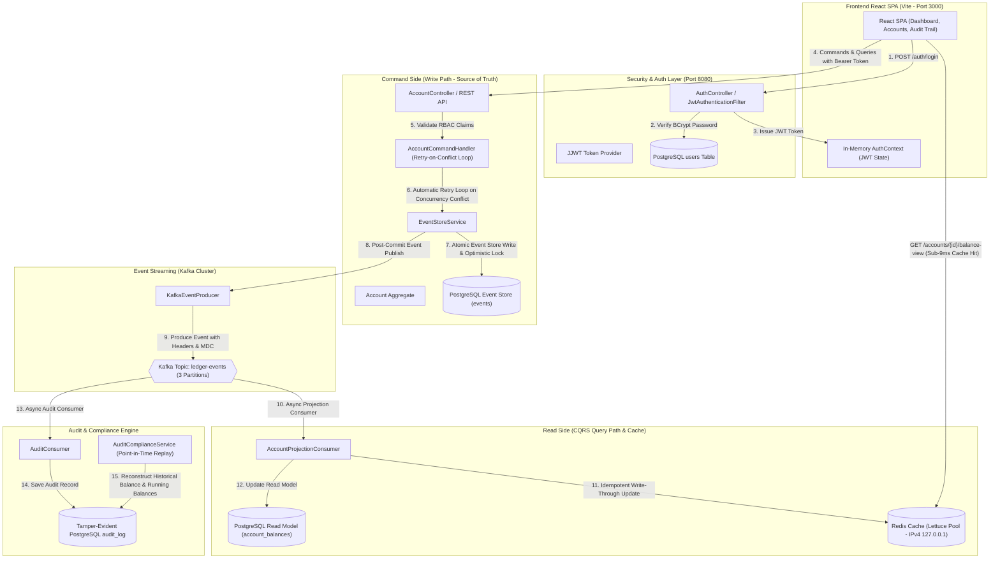

# Event-Sourced Digital Banking Ledger with CQRS Architecture & React SPA


An enterprise-grade, high-throughput Digital Banking Ledger built with **Spring Boot 3**, **PostgreSQL**, **Apache Kafka**, **Redis**, and a modern **React SPA (Vite)** frontend.

Implements **Event Sourcing**, **CQRS (Command Query Responsibility Segregation)**, **Double-Entry Accounting**, **Post-Quantum Cryptography (NIST ML-DSA-65 / Dilithium3 Digital Signatures)**, **SHA3-512 Cryptographic Event Hash-Chaining**, **Aggregate Snapshotting Engine ($O(1)$ Replay Acceleration)**, **Automatic Command Retries for Optimistic Locking Conflicts**, **Redis Lettuce Pooling (Cache-Aside & Write-Through)**, **JWT Security with RBAC**, and a **Tamper-Evident Audit & Compliance Panel** with **Point-in-Time Balance Reconstruction & Running Balance Event Breakdown**.


---

## 🏛️ System Architecture



---

## ✨ Key Features & Capabilities

### 1. 🎨 Warm Luxury React SPA Frontend (`/frontend`)
- **Modern Split-Screen Login**: Soft cream gradient background, rounded pill inputs, warm inline error banners, and demo quick-login buttons for Alice (`CUSTOMER`) and Admin (`COMPLIANCE`).
- **In-Memory JWT Token Handling**: Tokens stored strictly in React state memory (zero `localStorage` storage for security).
- **Accounts Portal**: Open accounts, make deposits/withdrawals, execute double-entry transfers, and inspect aggregate versioning.
- **CQRS Inspector**: Side-by-side comparison of Write Model (Event Store Replay) vs Read Model (Redis/Postgres Cache-Aside) with real-time synchronization latency benchmarking.
- **Concurrency Simulator**: Fire simultaneous concurrent commands to observe automatic retry-on-conflict behavior in real time.

### 2. 🛡️ Audit & Compliance Trail (`ADMIN` Only)
- **Point-in-Time Balance Reconstruction**: Replays events strictly up to any requested timestamp to reconstruct balance and aggregate version as of that moment.
- **Step-by-Step Event Replay Breakdown**: Expandable audit table displaying every replayed event, version, delta amount ($+\$500.00$, $-\$200.00$), running cumulative balance, and timestamp.
- **One-Click CSV Export**: Download point-in-time event replay breakdowns directly as `.csv` compliance reports.
- **Regulatory Reporting**: Generate date-range summary reports (total transaction count, total financial volume, and per-account activity share breakdown).
- **Quick Account Selectors**: Instant selector chips for active accounts to avoid manual UUID copy-pasting.

### 3. ⚡ High-Performance CQRS Read Side & Caching
- **Lettuce Connection Pooling & IPv4 Binding**: Optimized Redis connection pool using `commons-pool2` and `127.0.0.1` IPv4 loopback, reducing GET cache hit latency from 100–400ms down to **1–9ms**.
- **CORS Preflight Caching**: Preflight `OPTIONS` requests cached in browsers for 1 hour (`maxAge = 3600s`).

### 4. 🔄 Automatic Retry-on-Conflict (Concurrency Control)
- `AccountCommandHandler` executes write commands inside an automatic retry loop (up to 5 retries) with randomized exponential backoff (`30ms * attempt + random(70ms)`).
- Concurrent writes on the same account automatically serialize and succeed without returning HTTP 409 errors to the client.

---

## 📂 Project Structure

```text
CQRS/
├── docker-compose.yml                      # Infrastructure: PostgreSQL 16, Kafka KRaft, Redis 7, Kafka UI
├── pom.xml                                 # Spring Boot dependencies & Maven config
├── frontend/                               # React Single Page Application (Vite, React 18, Lucide)
│   ├── package.json
│   ├── vite.config.js                      # Vite dev server config (Port 3000)
│   └── src/
│       ├── context/AuthContext.jsx          # In-memory JWT session management
│       ├── services/api.js                 # Axios client wrapping Spring Boot backend
│       ├── pages/
│       │   ├── LoginPage.jsx               # Split-screen luxury login UI
│       │   ├── DashboardPage.jsx           # Active session & API tester
│       │   ├── AccountsPage.jsx            # Accounts, CQRS Inspector & Concurrency simulator
│       │   └── AuditTrailPage.jsx          # Point-in-time balance lookup & Regulatory reports
│       └── index.css                       # Design system tokens, warm luxury palette & dark mode
└── src/
    ├── main/
    │   ├── java/com/bank/ledger/
    │   │   ├── api/AccountController.java  # REST API (Accounts, Deposits, Withdrawals, Transfers, Events)
    │   │   ├── api/DTOs.java               # Structured DTO definitions
    │   │   ├── audit/                      # Tamper-evident audit consumer & compliance service
    │   │   ├── auth/                       # Spring Security, JWT provider, BCrypt, AuthController
    │   │   ├── command/                    # AccountAggregate & AccountCommandHandler (Retry loop)
    │   │   ├── config/                     # Redis pooling config & CORS setup
    │   │   ├── events/                     # Domain Events & Kafka Producer
    │   │   ├── eventstore/                 # Append-only Event Store & Optimistic Lock repository
    │   │   └── readmodel/                  # Kafka Projection Consumer & Redis Cache Service
    │   └── resources/
    │       ├── application.yml             # PostgreSQL, Kafka, Redis, Actuator config
    │       └── db/migration/               # Flyway database migration scripts (V1, V2, V3)
    └── test/                               # Automated JUnit 5 test suite
```

---

## 🔐 Seeded Test Credentials & Roles

| Username | Plaintext Password | Role | Permissions & Account Ownership Rules |
| :--- | :--- | :--- | :--- |
| **`admin`** | `admin123` | `ADMIN` | Full access to all accounts & Audit Compliance Trail. |
| **`alice`** | `alice123` | `CUSTOMER` | Access restricted strictly to accounts owned by `alice`. |
| **`bob`** | `bob123` | `CUSTOMER` | Access restricted strictly to accounts owned by `bob`. |

---

## 🚀 How to Run from Scratch

### Prerequisites
- **Docker Desktop** (must be running)
- **Java 17+** & **Maven**
- **Node.js 18+** & **npm**

### Step 1: Start Infrastructure Containers
```bash
docker compose up -d
```
*Starts PostgreSQL (5432), Kafka (9092), Redis (6379), and Kafka UI (8081).*

### Step 2: Start Spring Boot Backend
```bash
mvn spring-boot:run
```
*Backend runs on `http://localhost:8080`.*

### Step 3: Start React Frontend Application
Open a **new** terminal window:
```bash
cd frontend
npm install
npm run dev
```
*Frontend runs on `http://localhost:3000`.*

### Step 4: Open in Browser
Navigate to **`http://localhost:3000/`** in your browser.

---

## 🧪 Unit & Integration Testing

Run the backend automated test suite:
```bash
mvn test
```
**Test Coverage:**
- `AuditComplianceServiceTest`: Verifies point-in-time balance reconstruction, replayed event details, running balances, and regulatory report aggregation.
- `AuthSecurityTest`: Verifies BCrypt password matching and JWT token claim verification.
- `AccountAggregateTest`: Verifies aggregate event replay, insufficient balance validation, and double-entry accounting invariants.

Run frontend build verification:
```bash
cd frontend
npm run build
```

---

## 📜 License

This project is licensed under the Apache 2.0 License.
