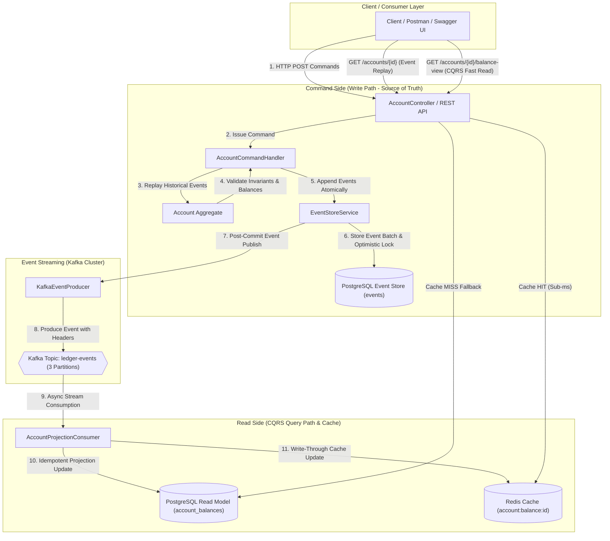

# Event-Sourced Digital Banking Ledger with CQRS Architecture


An enterprise-grade, high-throughput Digital Banking Ledger built with **Spring Boot 3**, **PostgreSQL**, **Apache Kafka**, and **Redis**. Implements **Event Sourcing**, **CQRS (Command Query Responsibility Segregation)**, **Double-Entry Accounting**, and **Redis Cache-Aside/Write-Through caching**.

---

## 🏛️ System Architecture



---

## 📂 Project Structure

```text
CQRS/
├── docker-compose.yml                      # Infrastructure: PostgreSQL 16, Kafka KRaft, Redis 7
├── pom.xml                                 # Maven dependencies (Spring Boot 3.3.0, Kafka, Redis, OpenAPI, Actuator)
└── src/
    ├── main/
    │   ├── java/com/bank/ledger/
    │   │   ├── api/
    │   │   │   ├── AccountController.java   # REST Controller (Commands + CQRS Queries + Swagger Annotations)
    │   │   │   ├── DTOs.java                # Immutable DTOs with Bean Validation (@NotNull, @Positive)
    │   │   │   └── GlobalExceptionHandler.java # Uniform REST exception mapper (400, 404, 409, 422, 500)
    │   │   ├── command/
    │   │   │   ├── AccountAggregate.java    # Pure Aggregate rebuilding state via event replay
    │   │   │   ├── AccountCommandHandler.java # Handles Open, Deposit, Withdraw, Transfer commands
    │   │   │   └── Commands.java            # Command definitions
    │   │   ├── config/
    │   │   │   ├── CorrelationIdFilter.java # Servlet filter for X-Correlation-ID tracing
    │   │   │   ├── OpenApiConfig.java       # Swagger UI OpenAPI 3.0 bean configuration
    │   │   │   └── RedisConfig.java         # RedisTemplate Jackson JSON serializer bean setup
    │   │   ├── events/
    │   │   │   ├── AccountOpenedEvent.java  # Domain Event: AccountOpened
    │   │   │   ├── FundsDepositedEvent.java # Domain Event: FundsDeposited
    │   │   │   ├── FundsWithdrawnEvent.java # Domain Event: FundsWithdrawn
    │   │   │   ├── TransferInitiatedEvent.java # Domain Event: TransferInitiated
    │   │   │   ├── KafkaEventProducer.java  # Publishes committed events to Kafka with headers & MDC
    │   │   │   └── KafkaTopicConfig.java   # Auto-creates 'ledger-events' (3 partitions)
    │   │   ├── eventstore/
    │   │   │   ├── EventEntity.java         # JPA entity for append-only 'events' table
    │   │   │   └── EventStoreService.java   # Appends events, enforces versioning & optimistic locking
    │   │   └── readmodel/
    │   │       ├── AccountBalanceEntity.java # Read model entity for 'account_balances'
    │   │       ├── AccountCacheService.java # Redis Cache-Aside & Write-Through operations
    │   │       └── AccountProjectionConsumer.java # Idempotent Kafka Listener projecting events to PG & Redis
    │   └── resources/
    │       ├── application.yml              # Database, Kafka, Redis, Actuator, & Logging config
    │       └── db/migration/
    │           ├── V1__init_event_store.sql # Schema migration for Event Store (events table & index)
    │           └── V2__init_read_model.sql  # Schema migration for CQRS Read Model (account_balances table)
    └── test/
        └── java/com/bank/ledger/command/
            └── AccountAggregateTest.java    # JUnit 5 unit tests for Aggregate, Replay & Invariants
```

---

## 🚀 Key Architectural Principles

> [!IMPORTANT]
> **1. Event Sourcing & Immutable Ledger**
> - The write side has **no mutable `balance` table**. Account state is reconstructed on-demand by replaying ordered, immutable domain events (`AccountOpened`, `FundsDeposited`, `FundsWithdrawn`, `TransferInitiated`) from PostgreSQL.

> [!NOTE]
> **2. Double-Entry Accounting Invariant**
> - Every transfer atomically generates a **Debit** entry (withdrawal on source) and a **Credit** entry (deposit on destination).
> - Enforces `SUM(Debits) == SUM(Credits)` prior to event persistence. If the invariant fails, the transaction is rejected.

> [!TIP]
> **3. Optimistic Concurrency Control**
> - Uses an aggregate `version` column and `(aggregate_id, version)` unique constraint in PostgreSQL to detect concurrent modifications, throwing `OptimisticLockingException` (HTTP 409 Conflict).

> [!NOTE]
> **4. CQRS Read Model & Redis Caching**
> - **Command Path**: Appends events to PostgreSQL event store.
> - **Async Projection**: `AccountProjectionConsumer` streams Kafka events and updates PostgreSQL `account_balances`.
> - **Write-Through**: `AccountProjectionConsumer` writes updated balances directly to Redis.
> - **Cache-Aside Read Path**: `GET /accounts/{id}/balance-view` checks Redis first (sub-millisecond), falling back to PostgreSQL read model on a cache miss.

---

## 🛠️ Technology Stack

- **Core Framework**: Java 17+, Spring Boot 3.3.0
- **Database**: PostgreSQL 16 (Event Store & CQRS Read Model)
- **Database Migrations**: Flyway
- **Event Streaming**: Apache Kafka 3.7.0 (KRaft mode)
- **Cache**: Redis 7
- **API Documentation**: Springdoc OpenAPI / Swagger UI
- **Observability**: Spring Boot Actuator & SLF4J MDC (`X-Correlation-ID`)
- **Testing**: JUnit 5

---

## ⚡ How to Run Locally

### Prerequisites
- Docker Desktop & Docker Compose
- Java 17+
- Maven 3.8+

### 1. Start Infrastructure Containers
```bash
docker compose up -d
```
Verify containers are healthy:
```bash
docker compose ps
```

### 2. Launch Spring Boot Application
```bash
mvn spring-boot:run
```
The server will start on `http://localhost:8080`.

---

## 🔍 Interactive Documentation & Health Checks

- **Swagger UI (Interactive API Tester)**:  
  [http://localhost:8080/swagger-ui.html](http://localhost:8080/swagger-ui.html)

- **Actuator Infrastructure Health Check**:  
  `GET http://localhost:8080/actuator/health`  
  *Returns health status for PostgreSQL, Redis, and disk space in a single payload.*

---

## 📡 API Reference & cURL Examples

### 1. Open a New Account
```bash
curl -X POST http://localhost:8080/accounts \
  -H "Content-Type: application/json" \
  -d '{
    "ownerName": "Alice Smith",
    "initialBalance": 1000.00
  }'
```
**Response (HTTP 201 Created):**
```json
{
  "accountId": "a1b2c3d4-5678-90ab-cdef-1234567890ab",
  "ownerName": "Alice Smith",
  "balance": 1000.00,
  "version": 1
}
```

---

### 2. Deposit Funds
```bash
curl -X POST http://localhost:8080/accounts/a1b2c3d4-5678-90ab-cdef-1234567890ab/deposit \
  -H "Content-Type: application/json" \
  -d '{
    "amount": 250.00
  }'
```
**Response (HTTP 200 OK):**
```json
{
  "accountId": "a1b2c3d4-5678-90ab-cdef-1234567890ab",
  "ownerName": "Alice Smith",
  "balance": 1250.00,
  "version": 2
}
```

---

### 3. Withdraw Funds
```bash
curl -X POST http://localhost:8080/accounts/a1b2c3d4-5678-90ab-cdef-1234567890ab/withdraw \
  -H "Content-Type: application/json" \
  -d '{
    "amount": 100.00
  }'
```
**Response (HTTP 200 OK):**
```json
{
  "accountId": "a1b2c3d4-5678-90ab-cdef-1234567890ab",
  "ownerName": "Alice Smith",
  "balance": 1150.00,
  "version": 3
}
```

---

### 4. Execute Double-Entry Transfer
```bash
curl -X POST http://localhost:8080/accounts/transfer \
  -H "Content-Type: application/json" \
  -d '{
    "fromAccountId": "a1b2c3d4-5678-90ab-cdef-1234567890ab",
    "toAccountId": "b2c3d4e5-6789-01bc-def0-2345678901bc",
    "amount": 300.00
  }'
```
**Response (HTTP 200 OK):**
```json
{
  "transferId": "98765432-abcd-ef01-2345-678901234567",
  "fromAccountId": "a1b2c3d4-5678-90ab-cdef-1234567890ab",
  "toAccountId": "b2c3d4e5-6789-01bc-def0-2345678901bc",
  "amount": 300.00,
  "status": "SUCCESS"
}
```

---

### 5. Event Replay Query (Source of Truth Path)
```bash
curl -X GET http://localhost:8080/accounts/a1b2c3d4-5678-90ab-cdef-1234567890ab
```
**Response (HTTP 200 OK):**
```json
{
  "accountId": "a1b2c3d4-5678-90ab-cdef-1234567890ab",
  "ownerName": "Alice Smith",
  "balance": 850.00,
  "version": 4
}
```

---

### 6. CQRS Fast Read Path (Redis Cache / PostgreSQL Read Model)
```bash
curl -X GET http://localhost:8080/accounts/a1b2c3d4-5678-90ab-cdef-1234567890ab/balance-view
```
**Response (HTTP 200 OK):**
```json
{
  "accountId": "a1b2c3d4-5678-90ab-cdef-1234567890ab",
  "ownerName": "Alice Smith",
  "balance": 850.00,
  "version": 4
}
```

---

## 🧪 Unit & Integration Testing

Run the automated test suite:
```bash
mvn clean test
```
**Tests Executed (`AccountAggregateTest`):**
- `replayCorrectlyRebuildsBalanceAndVersion`
- `insufficientBalanceRejectsWithdrawalBeforeEventWrite`
- `doubleEntryInvariantHoldsAfterTransfer`
- `zeroOrNegativeAmountIsRejected`
- `nonExistentAccountOperationsThrowException`

---

## 📜 License

This project is licensed under the Apache 2.0 License.
